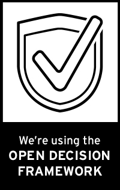

Want others to know that you're using the Open Decision Framework? Here are badges in a few different sizes that you can add to your project page or documentation. Feel free to link the image to the [Open Decision Framework repo](https://github.com/red-hat-people-team/open-decision-framework) on GitHub.

*Black and white*
* [Vertical](ODF_Badge_Mojo-sidebar.jpg)
* [Horizontal](ODF_Badge_Mojo-sidebar_horizontal.jpg)
* [Vertical for print](ODF_Badge_print.jpg)
* [Horizontal for print](ODF_Badge_print_horizontal.jpg)

*Color*
* [Vertical](ODF_Badge_Mojo-sidebar-red.jpg)
* [Horizontal](ODF_Badge_Mojo-sidebar_horizontal-red.jpg)
